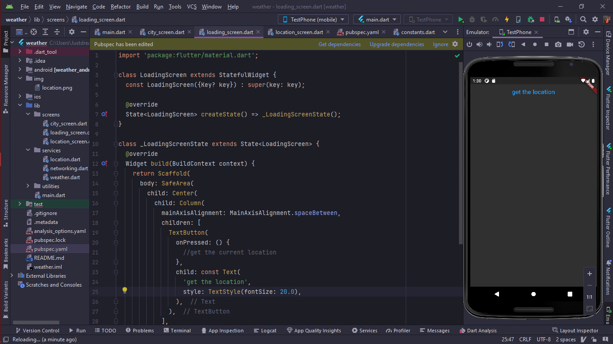
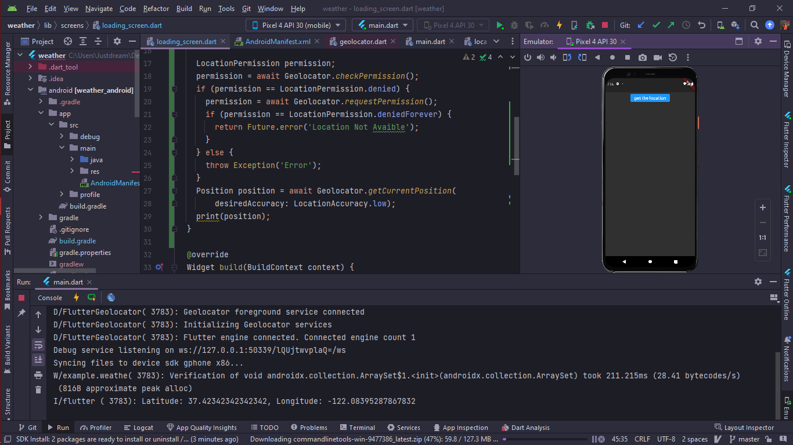
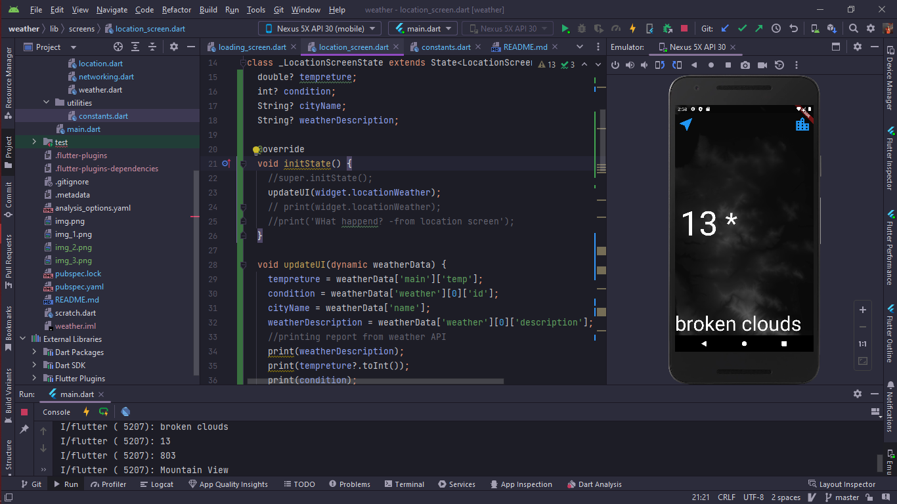
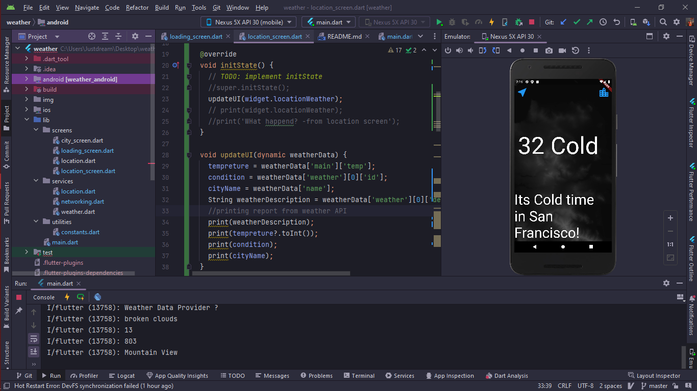
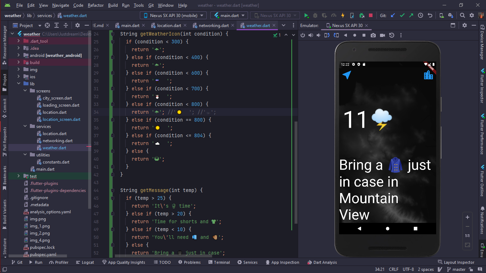
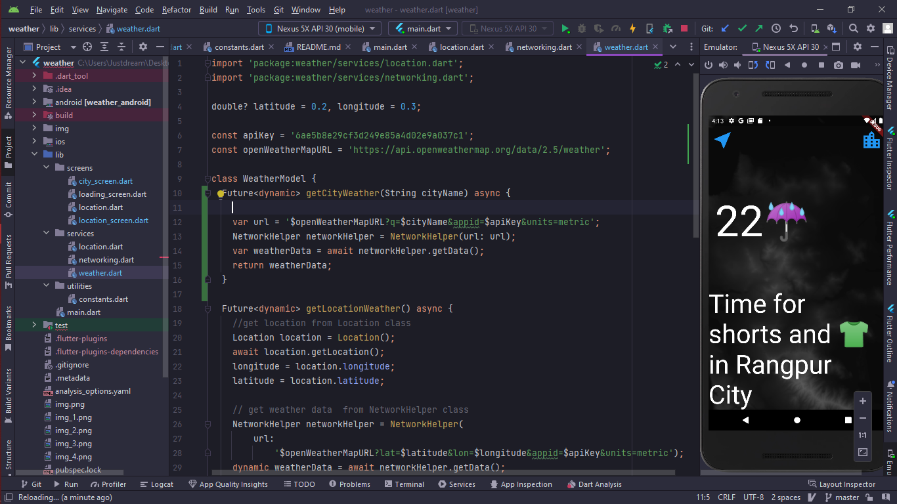

# weather

A new weather based Flutter App project.

## Getting Started

This project is a starting point for a Flutter application.

added fetch data functionality and came up with getting weather data from any location by weathermap API;

update location screen by sending piece of data from weather map API

added cityName as a Input and serve any city weather data in location screen which is user want to get !
finally ITS DONE !
